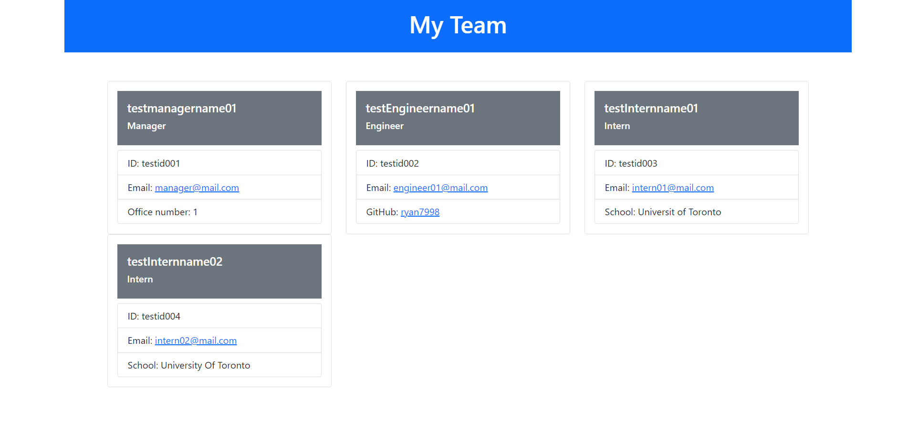

# Team-profile-generator
## Screenshot:

## USAGE:

This is a command-line application that accepts user input.

WHEN prompted for my team members and their information

THEN a HTML file is generated that displays a nicely formatted team roster based on user input

WHEN a user clicks on an email address in the HTML

THEN default email program opens and populates the TO field of the email with the address

WHEN user clicks on the GitHub username

THEN that GitHub profile opens in a new tab

WHEN user starts the application

THEN user is prompted to enter the team manager’s name, employee ID, email address, and office number

WHEN user enters the team manager’s name, employee ID, email address, and office number

THEN user is presented with a menu with the option to add an engineer or an intern or to finish building team

WHEN user selects the engineer option

THEN user is prompted to enter the engineer’s name, ID, email, and GitHub username, and taken back to the menu

WHEN user selects the intern option

THEN user is prompted to enter the intern’s name, ID, email, and school, and then taken back to the menu

WHEN user decides to finish building team

THEN user exit the application, and the HTML is generated

## DESCRIPTION:

 For unit test, the application use Jest. Test files are in __tests__ folder. The following files are performed for test:
 Employee.test.js, Engineer.test.js, Intern.test.js, Manager.test.js

 'dist' forlder contains the index.html which is created by the application

 'lib' folder contains the class files.

 'src' contains the page-template.js which is the template for the HTML file. Various parts of HTML file is generated conditionally.

 From first inquirer Prompt manager data is populated as an object named 'managerObj', which is saved as a property of a new object 'teamData' which we can call as 'teamData.managerData'.

 Later all other Employee data (Engineer and Intern) is saved as object in arrays(otherEmployeeData) inside the object 'teamData', which again we can call as 'teamData.otherEmployeeData'.

 Then we pass the teamData object to 'pageTemplate()' function in page-template.js which returns the page template in HTML syntax. Bootstrap library is used in the file.

 Finally, using 'writeFile()' from filesystem module index.html file in dist folder is generated.

## Walkthrough video: 
https://drive.google.com/file/d/1GSnQ2NIn3HmJIc6lKs-VZyXz2-LkoEOy/view
